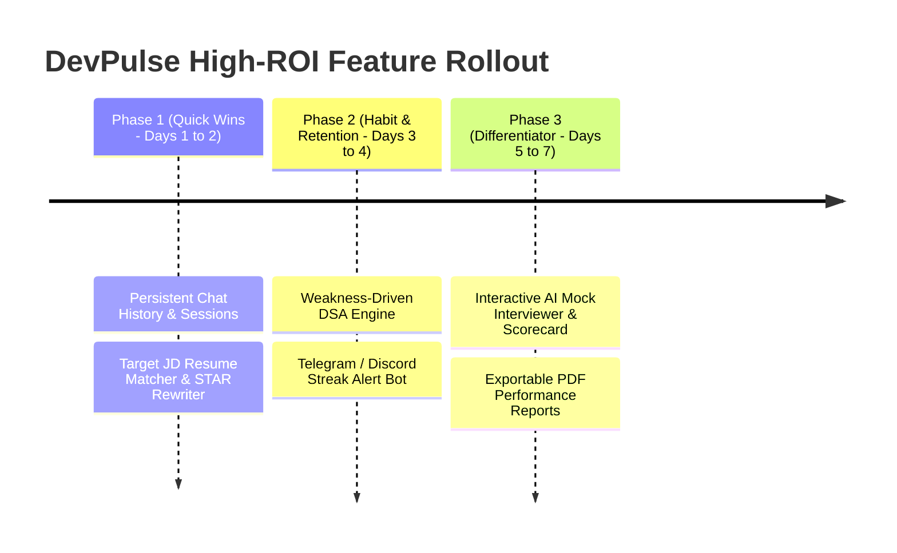

# 🚀 DevPulse (Future-Me-AI): Architecture Analysis & Top 5 High-ROI Implementations

---

## 📌 Executive Summary

**DevPulse** is a personalized AI coding mentor and developer dashboard. It bridges live developer telemetry (GitHub contribution graph, commits, repositories + LeetCode DSA stats, rankings, submissions) with a custom Google Gemini LLM coaching persona (`gemini-3.1-flash-lite`).

### Current Architecture Highlights:
- **Frontend:** React 18 (Vite) + CSS Modules + dynamic streaming UI via Server-Sent Events (SSE) / Fetch ReadableStream.
- **Backend:** Node.js + Express, Mongoose (MongoDB Atlas), ioredis / node-cache caching layer.
- **AI Layer:** Dynamic system prompt injection combining live GitHub metrics, LeetCode profile statistics, and resume review context.

---

## 📊 ROI Evaluation Matrix

| Rank | Feature Recommendation | User Impact | Implementation Effort | Retention Multiplier | Monetization Potential | ROI Score (out of 10) |
|:---:|:---|:---:|:---:|:---:|:---:|:---:|
| **#1** | **Target JD ATS Analyzer & STAR Resume Rewriter** | 🟢 Extremely High | 🟡 Low - Medium | 🟢 High | 🟢 Highest (SaaS Tier) | **9.6 / 10** |
| **#2** | **Weakness-Driven DSA Engine & Daily Challenge Recommender** | 🟢 Very High | 🟡 Low - Medium | 🟢 Highest (Daily Habit) | 🟢 High | **9.4 / 10** |
| **#3** | **Interactive AI Mock Interviewer (DSA & System Design)** | 🟢 Extremely High | 🟡 Medium | 🟢 Very High | 🟢 Highest (Pro Prep) | **9.2 / 10** |
| **#4** | **Persistent Chat History & Long-Term Developer Memory** | 🟢 High | 🟢 Low | 🟢 High (Prevents churn) | 🟡 Medium | **9.0 / 10** |
| **#5** | **Automated Daily Standup & Streak Alert Bot (Telegram/Discord/Email)** | 🟢 High | 🟢 Low | 🟢 Highest (DAU Booster) | 🟡 Medium | **8.8 / 10** |

---

## 💎 Top 5 High-ROI Implementations

---

### 1. 🎯 Target JD vs Resume ATS Matcher & STAR Bullet Rewriter
> **ROI Score: 9.6 / 10** | **Time to Implement: ~1–2 Days** | **Primary Value: Direct Career Conversion**

#### 🔍 Current Limitation:
The current Resume Reviewer performs a single generic audit (giving a score /10 and missing keywords). It does not test the resume against a specific target role (e.g., *Frontend Engineer at Stripe*, *Backend SDE-2 at Uber*).

#### 💡 High-ROI Enhancement:
1. **Dual-Input Mode:** Users upload their resume + paste the Target Job Description (JD).
2. **ATS Match % & Hard-Skill Gap Analysis:** Computes semantic similarity and exact missing skill keywords.
3. **STAR Bullet Point Rewriter:** An AI tool that converts passive points into high-impact metrics (Situation, Task, Action, Result) with strong action verbs.
4. **GitHub Proof Verifier:** Automatically matches projects on their GitHub profile to the skills required in the JD.

#### 🛠️ Technical Blueprint:
```javascript
// Sample Route: POST /api/ai/resume-jd-match
router.post('/resume-jd-match', verifyToken, async (req, res) => {
  const { resumeText, jobDescription } = req.body;
  const prompt = `
    Compare this Developer Resume with the Target Job Description.
    Output JSON format:
    {
      "matchScore": 82,
      "matchingSkills": ["Node.js", "MongoDB", "System Design"],
      "missingRequiredSkills": ["Kafka", "Kubernetes", "Redis Distributed Locks"],
      "optimizedBullets": [
        { "original": "Built backend for app", "improved": "Architected event-driven microservices in Node.js & Redis, reducing API latency by 38% under 5k concurrent RPS." }
      ],
      "atsWarning": "Resume contains 2-column tables which may fail ATS parsers."
    }
  `;
  // Call Gemini JSON Mode
});
```

---

### 2. 🧠 Weakness-Driven DSA Engine & Daily Target Challenge
> **ROI Score: 9.4 / 10** | **Time to Implement: ~1–2 Days** | **Primary Value: Core Daily Engagement (DAU)**

#### 🔍 Current Limitation:
The LeetCode integration only tracks high-level numbers (Easy/Medium/Hard totals) and recent 5 submissions. It does not guide the developer on *what to solve next* or diagnose algorithmic blind spots.

#### 💡 High-ROI Enhancement:
1. **Topic Gap Radar:** Analyzes solved problem tags (e.g., Dynamic Programming: 2, Graphs: 1, Sliding Window: 18) to highlight unbalanced prep.
2. **"Today's SDE Challenge":** Generates 1 curated problem daily tailored to their target company/weakness.
3. **3-Tier AI Hint System:** 
   - *Tier 1: Intuition / Visual Clue* (no code).
   - *Tier 2: Optimal Data Structure & Pattern* (e.g. Two Pointers + Monotonic Stack).
   - *Tier 3: Step-by-Step Pseudocode & Complexity Proof*.

---

### 3. 🎙️ Interactive AI Mock Interviewer with Instant Scorecard
> **ROI Score: 9.2 / 10** | **Time to Implement: ~2–3 Days** | **Primary Value: WOW Factor & Monetization Engine**

#### 🔍 Current Limitation:
The chatbot acts as a study buddy answering queries, but there is no simulated pressure testing or roleplay mode.

#### 💡 High-ROI Enhancement:
1. **Interview Modes:**
   - **DSA & Problem Solving:** AI presents a problem, listens to user's approach, asks edge-case questions, and evaluates Big-O complexity.
   - **System Design:** AI acts as a Staff Engineer walking through URL Shortener / Chat System / Rate Limiter architecture.
   - **Behavioral (STAR Method):** AI interviews based on user's actual GitHub repos and resume projects.
2. **Post-Interview Performance Scorecard:**
   - Communication clarity score (1–10).
   - Code optimality & edge-case handling.
   - Key areas to review before real interviews.

---

### 4. 🗄️ Persistent Chat Sessions & Long-Term Developer Memory
> **ROI Score: 9.0 / 10** | **Time to Implement: ~1 Day** | **Primary Value: User Retention & Context Continuity**

#### 🔍 Current Limitation:
Chat messages currently exist solely in client-side React state (`messages` in `useChat.js`). If the user refreshes the page or logs in on another device, all coaching conversations and customized advice are lost.

#### 💡 High-ROI Enhancement:
1. **Multi-Thread Chat Sessions:** Users can maintain distinct chat threads (e.g., *"System Design Prep"*, *"Resume Revamp"*, *"Daily Check-ins"*).
2. **Developer Memory Vector / Profile Insights:** Store persistent facts about the user (e.g., *"Targeting Amazon SDE-2 by Q3"*, *"Struggles with DP on trees"*, *"Preferred language: TypeScript"*).
3. **Automatic System Prompt Context Evolution:** The AI gets smarter the more the user chats with it.

#### 🛠️ MongoDB Schema:
```javascript
const conversationSchema = new mongoose.Schema({
  userId: { type: mongoose.Schema.Types.ObjectId, ref: 'User', required: true, index: true },
  title: { type: String, default: 'New Coaching Session' },
  messages: [{
    role: { type: String, enum: ['user', 'assistant', 'system'], required: true },
    content: { type: String, required: true },
    timestamp: { type: Date, default: Date.now }
  }],
  summary: { type: String, default: '' },
  updatedAt: { type: Date, default: Date.now }
});
```

---

### 5. ⚡ Automated Daily Standup & Streak Shield (Telegram / Discord / Email)
> **ROI Score: 8.8 / 10** | **Time to Implement: ~1 Day** | **Primary Value: Re-engagement & Habit Loop**

#### 🔍 Current Limitation:
Users only receive a Daily Brief when they actively open the web app. If a developer gets busy, they forget to visit, lose their streak, and churn.

#### 💡 High-ROI Enhancement:
1. **Zero-Friction Morning Briefing:** Sent at 8:30 AM via Telegram Bot, Discord Webhook, or Email.
2. **"Streak Shield" Evening Nudge:** If 0 commits or 0 LeetCode submissions are detected by 8:00 PM, send an urgent notification:
   > *"🔥 Manish, your 12-day streak is at risk! Solve 1 quick problem or commit your work to keep it alive."*
3. **Interactive Telegram / Discord Bot:** Allows users to reply to the bot to ask quick DSA questions or log a completed task directly from mobile.

---

## 🗓️ Recommended Implementation Roadmap



---

## 🏁 Summary Checklist

- [x] **File Created:** Saved as standalone strategy file [`HIGH_ROI_ROADMAP.md`](file:///c:/Users/manis/OneDrive/Desktop/WEBDEV/LLM/Future-Me-AI/HIGH_ROI_ROADMAP.md).
- [x] **ROI Ranked:** Evaluated with impact vs effort vs monetization benchmarks.
- [x] **Code & Schemas Included:** Concrete API designs, prompts, and Mongoose schemas ready for immediate development.
