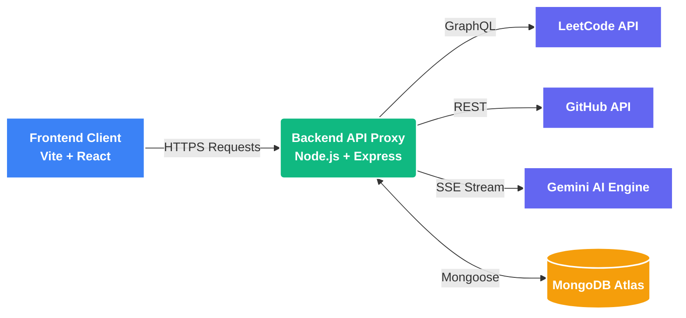

<p align="center">
  <a href="https://ai-dev-pulse.vercel.app" target="_blank">
    
  </a>
</p>
<p align="center">
  <em>An AI mentor that tracks your real GitHub/LeetCode activity and coaches you like a senior engineer.</em>
</p>

## 🚀 Live Demo
**👉 [Experience DevPulse Live](https://ai-dev-pulse.vercel.app)** 

## Why I Built This
I wanted a developer dashboard that didn't just passively show stats, but actively used them to provide personalized mentorship. I deliberately skipped complex RAG (Retrieval-Augmented Generation) setups, opting instead for dynamic, real-time prompt generation to keep the architecture fast, lean, and highly personalized for each user.

## Tech Stack
| Frontend | Backend | Database | APIs |
|----------|---------|----------|------|
| React (Vite) | Node.js | MongoDB Atlas | Google Gemini (Flash-Lite) |
| CSS Modules | Express | Mongoose | GitHub API |
| Vercel | Render | node-cache | LeetCode GraphQL |

## Key Features
- **Multi-User Authentication:** Secure JWT-based login system allowing individual developers to maintain their own persistent stats, AI context, and dashboards.
- **Real-Time Git & LeetCode Tracking:** Live fetching of daily commits, current streaks, and solved DSA problems.
- **AI Coach (Gemini):** A chat interface that streams responses token-by-token (SSE) acting as a senior mentor.
- **Resume Reviewer:** Upload your resume for an instant, critical breakdown from a "senior tech recruiter" perspective.
- **Daily Briefings:** Automatic generation of a motivational morning brief based strictly on your yesterday vs. today stats.

## Architecture


## ⚙️ Challenges & How I Solved Them

**Challenge 1: LeetCode has no official public API**  
LeetCode doesn't offer a documented REST API, so fetching solved-problem counts wasn't straightforward.  
**Solution:** Reverse-engineered their internal GraphQL endpoint (used by their own frontend) and built a backend proxy to query it safely, avoiding CORS issues since it's called server-side, not from the browser.

**Challenge 2: GitHub's 60 req/hr rate limit**  
With multiple users refreshing dashboards, unauthenticated GitHub calls would get rate-limited fast.  
**Solution:** Added a GitHub Personal Access Token (5,000 req/hr) plus a 1-hour `node-cache` layer, so repeated requests for the same user serve cached data instead of re-hitting GitHub every time.

**Challenge 3: Chat responses felt slow / robotic**  
A normal request-response chat meant users stared at a loading spinner for 5-10 seconds with zero feedback.  
**Solution:** Implemented Server-Sent Events (SSE) so Gemini's response streams token-by-token, giving a real-time "typing" effect — drastically improved perceived speed without changing actual latency.

**Challenge 4: Personalizing AI responses without RAG complexity**  
Each user has GitHub/LeetCode/resume context, and naive RAG setups (vector DB, embeddings) felt like overkill for small per-user data.  
**Solution:** Decided to dynamically generate a system prompt at request time, injecting real-time stats and resume context directly — simpler, faster, and fully justified since the data per user is small (a few hundred tokens), not large enough to need retrieval.

**Challenge 5: Securing secrets while keeping CORS open enough for the frontend**  
Needed the Gemini API key, GitHub token, and JWT secret hidden, but still let only my deployed frontend talk to the backend.  
**Solution:** Stored all secrets in `.env` files (never committed), and locked CORS to a single `FRONTEND_URL` env variable instead of allowing all origins.

## Setup Instructions

### 1. Clone & Install
```bash
git clone https://github.com/manishcodess/DevPulse.git
cd DevPulse

# Install backend
cd backend
npm install

# Install frontend
cd ../frontend
npm install
```

### 2. Environment Variables
Create `.env` in both `frontend` and `backend` using the provided `.env.example` templates.

### 3. Run Locally
Open two terminal windows:
```bash
# Terminal 1: Backend (runs on port 3001)
cd backend
npm start

# Terminal 2: Frontend (runs on port 5173)
cd frontend
npm run dev
```
